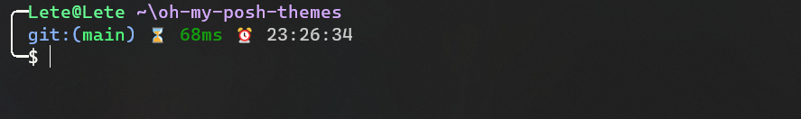

# Usage

Take bash as an example, see oh-my-posh official website [Config syntax](https://ohmyposh.dev/docs/installation/customize#config-syntax)

```bash
# Download the theme to your local area and use the local address
eval "$(oh-my-posh init bash --config ~/lete114.minimal.omp.yaml)"


# Once altered, reload your profile for the changes to take effect.
exec bash
```

## lete114

